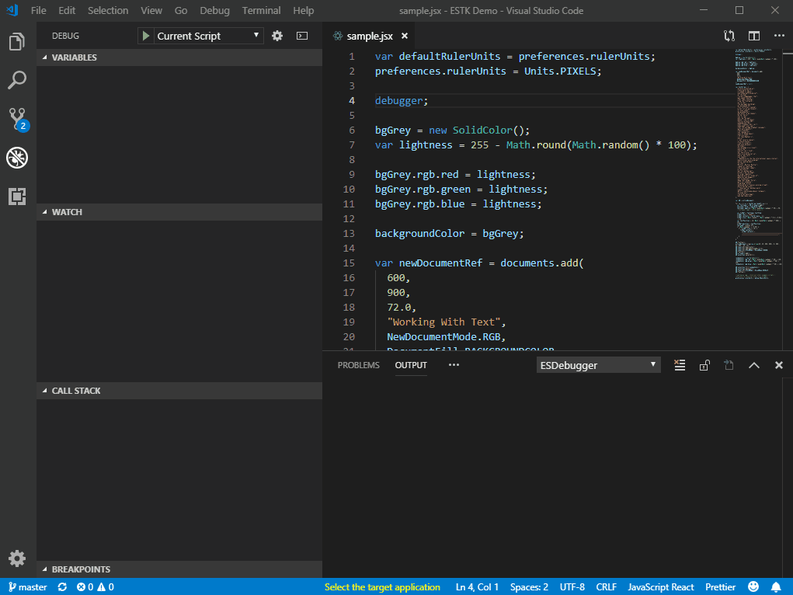

# ExtendScript Debugger for Visual Studio Code

**Supported features**
* Target and Engine Information Bar - ExtendScript Developers can launch the supported Adobe's point product and select ExtendScript engine
* Call Stack
* Breakpoints
	* Hit counts
	* Expressions
	* debugger statement
* Variable Inspection
	* Local Scope and Global Scope
	* Change a variable
* Debugging commands
	* Continue
	* stepin
	* stepover
	* stepout
	* stop
	* restart
* Debug Console
	* Expression evaluation
* Expression Evaluation on Hover
* Export ExtendScript to JSXBIN
* Target started debug session

**Unsupported scenarios**
* Profiling Support
* OMV
* Functions/Auto-Completion
* Scripts Panel
