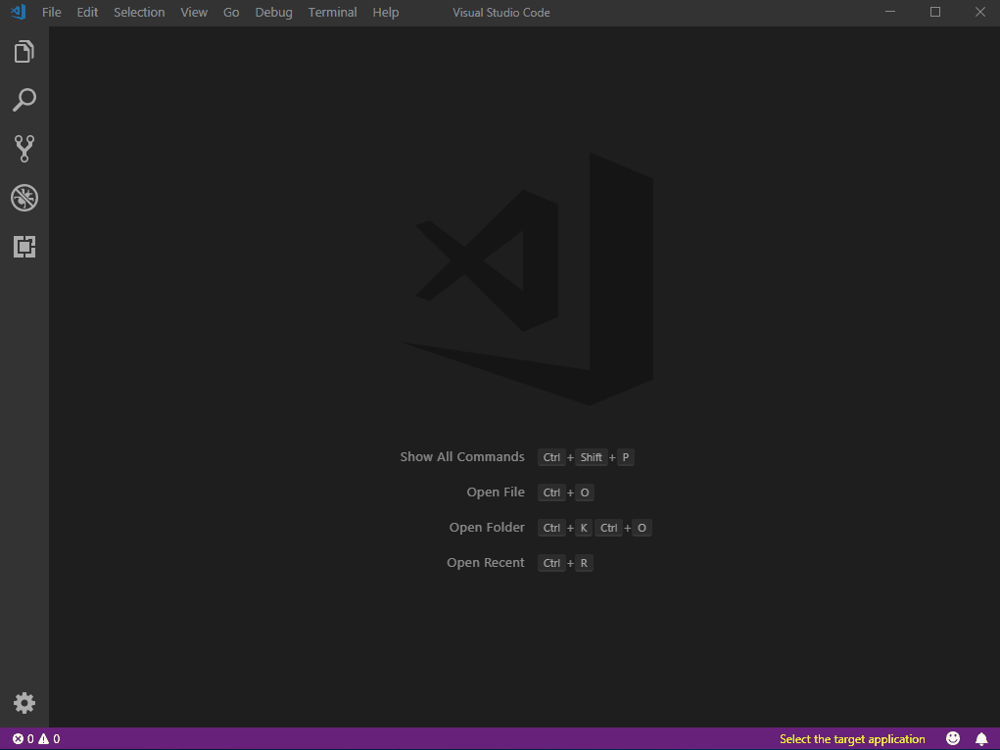
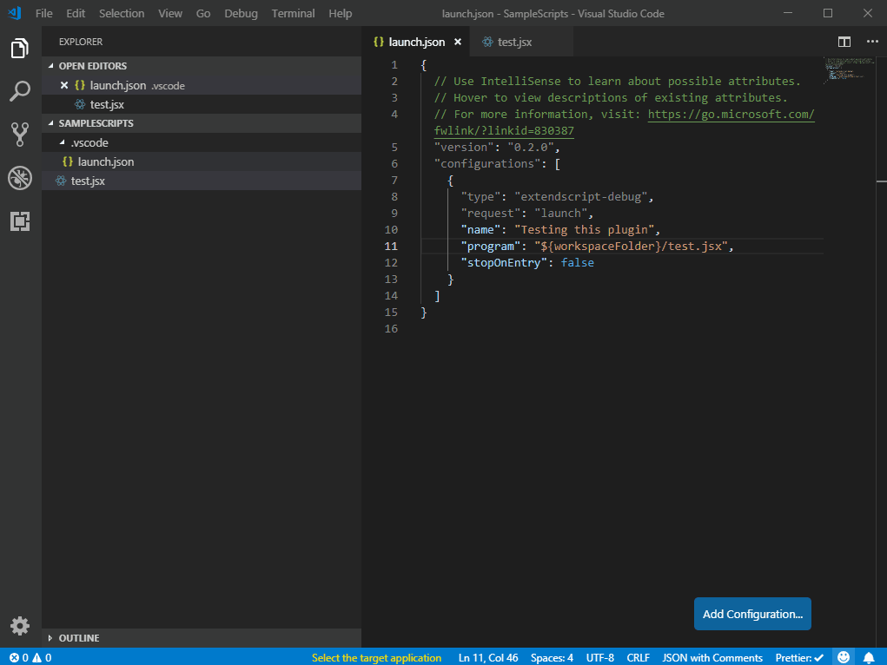

# ExtendScript Debugger for Visual Studio Code


**Supported features**
* Target and Engine Information Bar - ExtendScript Developers can launch the supported Adobe's point product and select ExtendScript engine
* Call Stack
* Breakpoints
	* Hit counts
	* Expressions
	* debugger statement
* Variable Inspection
	* Local Scope and Global Scope
	* Change a variable
* Debugging commands
	* Continue
	* stepin
	* stepover
	* stepout
	* stop
	* restart
* Debug Console
	* Expression evaluation
* Expression Evaluation on Hover
* Export ExtendScript to JSXBIN
* Target started debug session

**Unsupported scenarios**
* Profiling Support
* OMV
* Functions/Auto-Completion
* Scripts Panel

## Getting Started
1. [Install the extension](https://marketplace.visualstudio.com/items?itemName=adobe.extendscript-debug)
2. Restart VS Code and open the folder containing the project you want to work on.

## Using the debugger

When your launch config is set up, you can debug your project. Pick a launch config from the dropdown on the Debug pane in Code. Press the play button or F5 to start.

### Configuration

In your project, go to the debugger and hit the little gear icon and choose _ExtendScript Debug_. A new launch configuration will be created for you with following configurations:
```
{
    // Use IntelliSense to learn about possible attributes.
    // Hover to view descriptions of existing attributes.
    // For more information, visit: https://go.microsoft.com/fwlink/?linkid=830387
    "version": "1.0.0",
    "configurations": [
        {
            "type": "extendscript-debug",
            "request": "launch",
            "name": "Ask for script name",
            "program": "${workspaceFolder}/${command:AskForScriptName}",
            "stopOnEntry": false
        }
    ]
}
```

Add the configuration needed from the [supported launch configuration options](#supported-launchjson-settings) and save the _launch.json_ file.



### Debugging

* With your .jsx file open and the configuration done click on "Select Target Application"
* Choose the application that your .jsx file is compatible with
	* `Note`: You may also edit the launch.json to launch or run your target application automatically.
* If the application is not currently running you will be prompted to open it by typing y and Enter.
* Add breakpoints and click the green "Play" button.
* A new UI bar will appear at the top of the VSCode window with arrow buttons for:
	* Continue
	* Step Over
	* Step Into
	* Step Out
	* Restart
	* Stop



## Notes

- This Release is for MacOS only. A Windows version will follow in about two weeks. It's possible to install it in Windows also.
- The debugger works like [other VSCode debugging](https://code.visualstudio.com/docs/editor/debugging).
- Please uninstall any previous extensions related to ExtendScript as those extensions can conflict with breakpoints functionality.
- VSCode ESDebugger extension and ESTK application can’t run simultaneously.
- VSCode does not recognize #target and #targetengine commands.
- The "Watch" section of Debug mode does nothing.

## Resources

- You may also find it helpful to install this [ExtendScript](https://marketplace.visualstudio.com/items?itemName=hennamann.jsx) VSCode extension
- [Official VSCode Debugging Documentation](https://code.visualstudio.com/docs/editor/debugging)

## Forums

- [Creative Cloud Developer Prerelease Forums](https://forums.adobeprerelease.com/exmancmd/categories/estkvsc)


## Troubleshooting
The following steps are good standard troubleshooting, as well as troubleshooting "**Error ##15 Can't initialize target.**"

* Make sure the ESTK stand-alone application is closed
* Close the target application (example; Photoshop)
* Close Visual Studio Code
* Make sure there are no VS Code Helpers processes in the Activity Monitor (Mac) or Task Manager (Windows)
* Restart Visual Studio Code
* Does it work then?
* If not, does a reboot help?

If you continue to run into problems, please report them in the [Forums](https://forums.adobeprerelease.com/exmancmd/categories/estkvsc)

## FAQ
**Q. Where is the actual error displayed?**

A. When you hover over the words on the line that errors, there will be a popup showing the error. The error should be there in Output Console too.

**Q. I am getting Error ##15 Can't initialize target.**

A. Please try following the steps in the Troubleshooting section above. If you continue to run into this error, please tell us about it in the [Forums](https://forums.adobeprerelease.com/exmancmd/categories/estkvsc)

**Q. Can I set the Target Application in launch.json?**

A. You can set the target application in `launch.json`. 

For this you will need target specifier. To get the target specifier, put `"trace" = true` in your `launch.json`. When you start a session in your desired application (by choosing from "Select the target application"), the first line in Debug Console/Output Console will be `Starting <yourScript> in target: <targetSpecifier> and engine: <engineName>`. You can then get these two values and put in your `launch.json` configuration: 

 ```"targetSpecifier": "photoshop-130.064", "engineName": "main" ```

 **Q. How can I avoid the `ask for name` prompt?**

A. You can avoid the 'ask for name' prompt by putting the script name into the `launch.json` file. For example, my script is named `test.jsx`:

```json
{
  "version": "0.2.0",
  "configurations": [    
    {
      "type": "extendscript-debug",
      "request": "launch",
      "name": "Testing this plugin",
      "program": "${workspaceFolder}/test.jsx"
    }
  ]
}
```

## Supported launch.json settings:

| Property | Type | Description | Default Value |
| --- | --- | --- | --- |
| `program` | string | Absolute path to a script. | *${workspaceFolder}/${command:AskForScriptName}* |
| `cwd` | string | Absolute path to the directory of the program being debugged. | *${workspaceFolder}* |
| `targetSpecifier` | string | The target specifier in which the program will be debugged. | *empty* |
| `engineName` | string | The engine name in which the program will be debugged. | *empty* |
| `targetStartedSession` | boolean | Session target started. | *false* |
| `breakXML` | string | The break XML in case target started the session. | *""* |
| `excludes` | array | Excludes from variable display. Can be any combination of 'undefined', 'builtin', 'Function', 'prototype'. | *[ "undefined", "builtin", "Function", "prototype" ]* |
| `maxArrayElements` | number | Enter the maximum number of array elements to display. | *20* |
| `trace` | boolean | Enable logging of the ExtendScript debug session. | *true* |
| `traceString` | string | Enable extended logging of the ExtendScript debug adapter. Should be one of 'V', 'L', 'W', 'E'. This stands for Verbose, Log, Warn and Error respectively. | *""* |
| `logFile` | string | Enable logging of the ExtendScript debug session in this log file(Absolute Path). | *""* |
| `dontBreakOnErrors` | boolean | Do Not Break on Guarded Exceptions | *true* |
| `debugLevel` | number | Specify Debug Level: 0 - No Break, 1 - Break, 2 - Immediate Break | *1* |
| `stopOnEntry` | boolean | Should be true if session should break immediately. | *false* |


